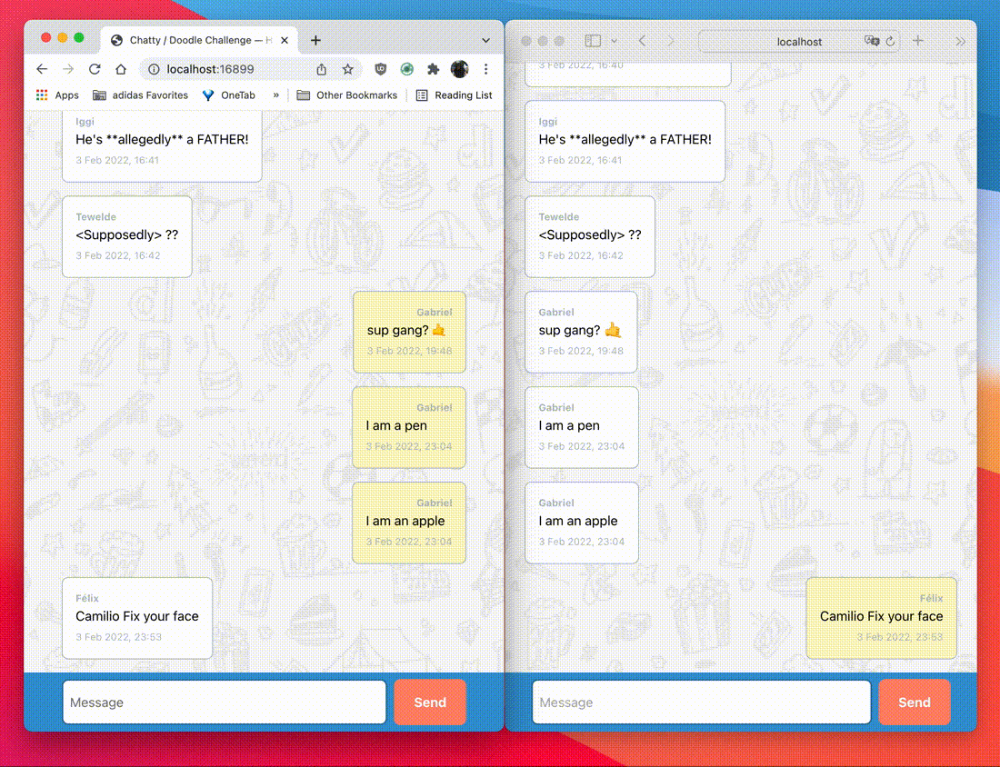

# Chatty — Senior Frontend Engineer Hiring Challenge.
> Author: Halil Kayer.



## Overview
This is a reactjs based application. User can receive and send messages over and API.
Package manager is **yarn** v.3.1.1. Best thing of using yarn is, it does not require to be downloaded
or installed on your system additionally, already packed up and comes in the project just like the source code.
Yet, there is a requirement for running  yarn v.3.1.1 which is node.js.
It must be version 16.10 or above due to corepack capabilities. Yarn Plug'n'Play enabled (https://yarnpkg.com/features/pnp).
So don't expect node_modules here in project after run `yarn install`.
**Parcel** used for bundler, reason is shortened the time for creating and spinning up the project.
**Prettier** is the formatting tool for all the js, json files. Default formatting settings used for the aforementioned files.
Some styles are borrowed from bootstrap, and I also use css reset from the renowned Josh Comeau. **CSS Modules** is the
tool for managing overall styling.


## Commands
First of all, please make sure your `node.js` version is equal to or higher than `16.10`.
There's a `engines` entry in `package.json` so if you have lower version,
unfortunately projects won't run any command.

Once you have the necessary `node.js` version available in your system, please enable `corepack` via

```shell
corepack enable
```

Corepack is included by default with all Node.js installs, but is currently opt-in.
So you must make sure it's enabled by running the command above.
p.s Please be aware Node.js comes with yarn as well since v.16.9.0 (https://nodejs.org/ja/blog/release/v16.9.0/#corepack).
>  Corepack will let you use Yarn and pnpm without having to install them - just like what currently happens with npm,

You can test it with

```shell
> where yarn 
/Users/kjaer/.nvm/versions/node/v16.13.2/bin/yarn
```

As a second step, dependencies should be installed via,

```shell
yarn install
```

these 2 commands above, must be run before we look to the other commands in the project.

```shell
yarn start
```

It spins up the project locally and automatically opens the page in `chrome` browser.
Project served from 16899 port (http://localhost:16899)

```shell
yarn format
```

Prettier commands that formats the code.

## Solution

For this challenge, I focused on the delivery. That lead me to make some of decisions which they are:
- using tools that I have recently very familiar,
- don't paralyse of what to choose, choose the simplest option.
- don't think twice. Time's has more weight than other factors.
- focus on making MVP. Not less.

After pointing out these key factors, I started to work on a blueprint on the paper first. I treated like prepping the final exams in the college.

So I drew the sketches, flows, decided the techniques and tools on the paper and in 3 hours I tried to accomplish them.

So here is my solution:
*It's the polling based chat application.*

Considering the fact that, Given API is stateful which accepts and returns user messages. So my first decision about it. I use the API single source of truth for all the messages. Every message appeared on the screen came from API via GET. Even though, when user submit a message to API and API returns it, I omitted. Because keeping a state from 2 different resources (one is chat history from API, getting via GET method and one is user messages returns after submit) introduces complexities. In order to avoid that complexity and keep things  simple and straight-forward, I only consider API response of GET requests for single source of truth of all messages.

This brings another problem into the table. How do I know who's the user? This is seemingly an easy concern to tackle. I simply asked users their name, so I will use their input while they're sending a message. It also allows me to visualise the previous messages.

It doesn't point out in the instructions, but I had to include this flow in order to achieve the MVP. So simply relied on `window.prompt` in order to get users' name and kept in the state during the application running.

I divided the app into 2 main component, Chat message form and Chat history. Chat history is only minds to showing messages as well as getting them from API (polling). In order to do that, I simply rely on `setInterval` and requested chat history every 5 seconds.

There's one exception, though. In order to make the app more responsive, the 5 seconds interval will be reset when the user posts a message. By doing so, they will see their messages relatively shorter than 5 seconds.

So far, Chat history and Chat message form are the main components and both of them very independent of each other. For the last use case (resetting polling interval) I have to tell Chat history to request messages immediately when Chat message form sends a message. In order to achieve this, I set a very naive notification flagging, where Chat message form set the flag `true` every time it sends a message and Chat history sets the flag `false` after immediately requesting messages from API.

To sum up, polling, asking users' their name, setting notification between components are the key architectural decisions of the app. Moreover, I'd like to mention 2 time-saver factor as well: Timestamp formatting. I get used to using a 3rd party library (Luxon, date-fns) for this purpose but here in MVP mindset I prefer to use `toLocaleString` of Date object, and `Intl.DateTimeFormat` for further formatting. I dare to use it directly in the template, so component body stay clean and out of date/time parsing logic. It does the decent job for timestamp formatting and saved me time too.

For styling, I used CSS custom properties (variables) for colors and sizing. CSS Modules is used for component
specific styling except `App` component.  It holds custom properties and general purpose classes.

Oh! I almost forget, CSS does fantastic job keeping the history scrolled-bottom position. Instead, keep calculating the position
of the history wrapper and new messages height, I used `flexbox`'s `column-reverse`. So whenever a new message
receives, it kept on the bottom and old messages pushes up.

### Resources:
1. https://www.joshwcomeau.com/css/custom-css-reset/
2. https://getbootstrap.com/docs/5.1/layout/breakpoints/ -> for Container,
3. https://codereview.stackexchange.com/a/195482/227611 ->for polling
4. https://stackoverflow.com/a/70827129/5018572 -> keep the chat history bottom.
